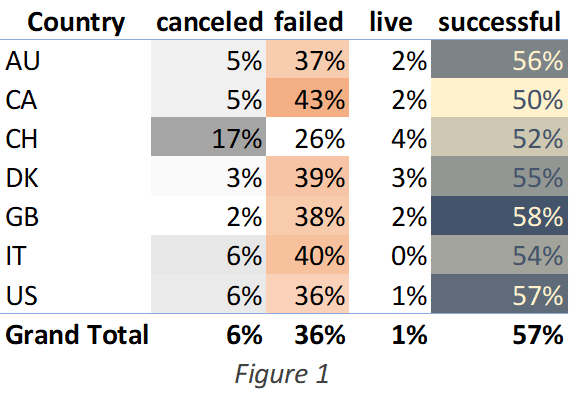
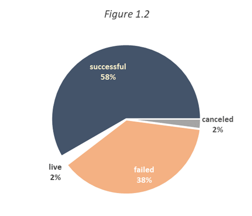
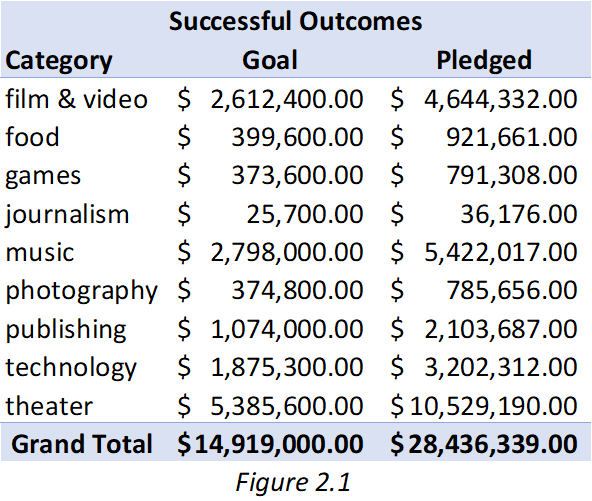
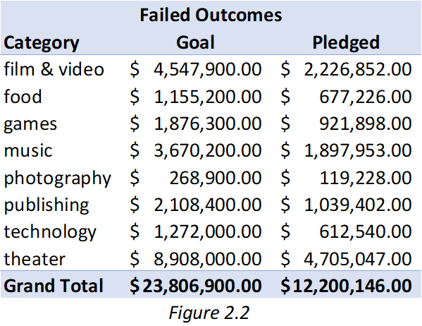
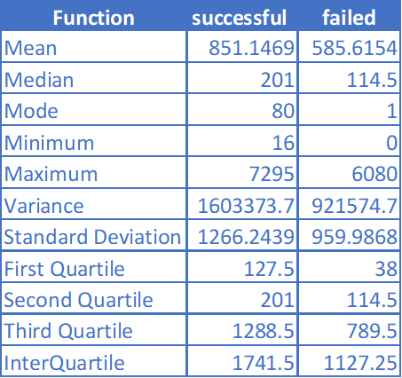
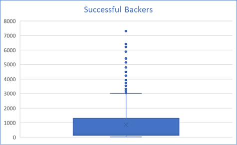
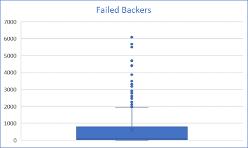
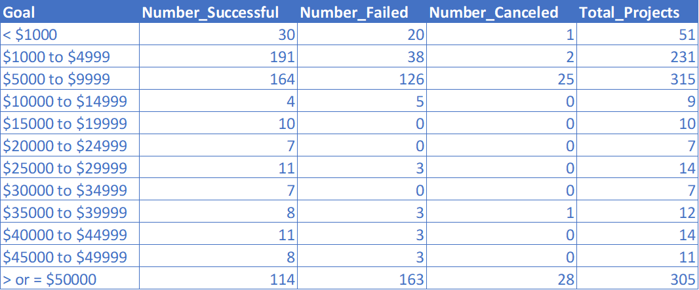

# Hello
A quick description of each item in this project is included below.

## CrowdFundingReport 
Contains answers to the first three questions posed after formatting of pivot tables listed in challenge.

## CrowdfundingStatisticalAnalysis
Contains answers to the last two questions posed at the end of the challenge.

## Images
Items listed below except picture 1 were derived from analyzing the data contained in this challenge.

## References
Code for images provided by David Chao in Tutoring session from September 1, 2023.
Data for this dataset was generated by edX Boot Camps LLC, and is intended for educational purposes only.